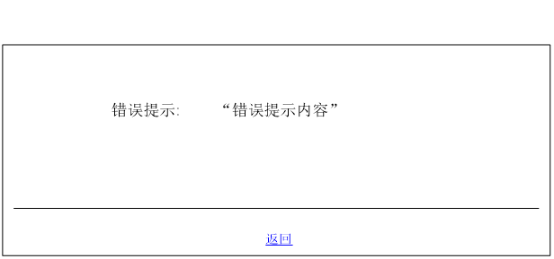

[toc]


# Xxx系统

<div style="font-size: 20px; text-align: center;"> 详细设计说明书</div>

<div style="text-align: center;">(内部资料 请勿外传)</div>


| 编写： |      | 日期： |      |
| :----: | ---- | :----: | ---- |
| 检查： |      | 日期： |      |
| 审核： |      | 日期： |      |
| 批准： |      | 日期： |      |


<div style="text-align: center;">XX公司</div>

<div style="text-align: center;">版权所有 不得复制</div>

**文档变更记录**

| 序号 | 变更（+/-）说明 | 作者 | 版本号 | 日期 | 批准 |
| --- | ------------- | ---- | ----- | ---- | --- |
| 1   |               |      |      |       |     |


# 引言

## 编写目的和范围

说明写这份详细设计说明书的目的。

本详细设计说明书编写的目的是说明程序模块的设计考虑，包括程序描述、输入/输出、算法和流程逻辑等，为软件编程和系统维护提供基础。本说明书的预期读者为系统设计人员、软件开发人员、软件测试人员和项目评审人员。

## 术语表

定义系统或产品中涉及的重要术语，为读者在阅读文档时提供必要的参考信息。

|序号|术语或缩略语|说明性定义|
| :--: | :--------------: | :-----------: |
|  1  |         PM        | Project Manager,项目经理 |

## 参考资料

列出有关资料的名称、作者、文件编号或版本等。参考资料包括：

a．需求说明书、架构设计说明书等；

b．本项目的其他已发表的文件；

c．引用文件、资料、软件开发标准等。

|资料名称|作者 |文件编号、版本|资料存放地点|
| ---- | ------|------|--------|
|      |       |      |        |


## 使用的文字处理和绘图工具

文字处理软件：[编写设计文档使用的文字处理软件，如RedOffice ]

绘图工具：[使用的UML工具，如Rose、Jude、Visio]

# 全局数据结构说明

本章说明本程序系统中使用的全局数据常量、变量和数据结构。

## 常量

包括数据文件名称及其所在目录，功能说明，具体常量说明等。

## 变量

本章说明本程序系统中使用的全局数据常量、变量和数据结构。

## 数据结构

包括数据结构名称，功能说明，具体数据结构说明（定义、注释、取值）等。

# 模块设计

## 用例图

## 功能设计说明

### 模块1

模块1主要分为以下几个子模块：子模块1、子模块2和子模块N。

#### 子模块1

##### 设计图

##### 功能描述

简要描述子模块1的业务功能。

##### 输入数据

详细描述用户输入的数据(包括任何输入设备)以及这些数据的有效性检验规则。

详细描述从物理模型中的哪些表获取数据以及获取这些数据的条件。

##### 输出数据

详细描述子功能1所产生的数据以及这些数据的表现形式。

##### 业务算法和流程

从业务角度详细描述根据输入数据产生输出数据的业务算法和流程。

##### 数据设计

给出本程序中的局部数据结构说明，包括数据结构名称，功能说明，具体数据结构说明（定义、注释设计、取值）等。相关数据库表，数据存储设计（具体说明需要以文件方式保存的数据文件名、数据存储格式、数据项及属性等。）

##### 源程序文件说明

给出本程序的各源程序文件的说明，包括源程序文件名称及其所在目录，功能说明，包含的前导文件及函数名称等。

##### 函数说明

具体说明本程序中的各个函数，包括函数名称及其所在文件，功能，格式，参数，全局变量，局部变量，返回值，算法说明，使用约束等。

##### 限制条件

##### 其他说明

### 模块2

模块1主要分为以下几个子模块：子模块1、子模块2和子模块N。

#### 子模块1

##### 设计图

##### 功能描述

简要描述子模块1的业务功能。

##### 输入数据

详细描述用户输入的数据(包括任何输入设备)以及这些数据的有效性检验规则。

详细描述从物理模型中的哪些表获取数据以及获取这些数据的条件。

##### 输出数据

详细描述子功能1所产生的数据以及这些数据的表现形式。

##### 业务算法和流程

从业务角度详细描述根据输入数据产生输出数据的业务算法和流程。

##### 数据设计

给出本程序中的局部数据结构说明，包括数据结构名称，功能说明，具体数据结构说明（定义、注释设计、取值）等。相关数据库表，数据存储设计（具体说明需要以文件方式保存的数据文件名、数据存储格式、数据项及属性等。）

##### 源程序文件说明

给出本程序的各源程序文件的说明，包括源程序文件名称及其所在目录，功能说明，包含的前导文件及函数名称等。

##### 函数说明

具体说明本程序中的各个函数，包括函数名称及其所在文件，功能，格式，参数，全局变量，局部变量，返回值，算法说明，使用约束等。

##### 限制条件

##### 其他说明

# 接口设计

## 内部接口

## 外部接口

### 接口说明

例如：xx子系统通过xx从xx子系统取得xx等，相关标准，调用示例，可根据需要增加章节描述接口。

### 调用方式

例如：内部接口调用：

```java
/**
 * 通过用户服务号码取得该客户认证密码等信息，如果该客户存在返回为0，其他情况参考错误编码
 */
public RUserInfo getUserInfo (String userNo);
```

# 数据库设计

详见\[xxx数据库设计说明书\]

如果数据库设计内容比较少，则直接在此处描述。

# 系统安全保密设计

## 说明

例如：由于存在与外部系统的接口,所以需要考虑访问安全的问题.

## 设计

例如：分为数据传输部分,IP过滤部分,身份验证部分.\[章节可补充\]

### 数据传输部分

例如：在部分数据传递的时候,考虑以https协议,需要在部署的时候作相关处理.

### IP过滤分部

例如：可在系统前端通过Filter实现,该Filter实现对该地址访问的IP过滤作用.可信任IP地址通过xml文件进行配置.

### 身份验证部分

例如：对信任的用户,颁发身份验证码,通过该标识进行身份识别.

# 系统性能设计

# 系统出错处理

例如：为了在系统出现异常情况下给用户以明确的提示，可采用两种方式予以提示：

1．使用Javascript的alert()函数直接提示，这主要在输入或修改的情况下使用；

2．使用统一的错误界面提示，该界面对应于errorpage.jsp页面。错误界面样式如下图所示：



<div style="text-align: center;">错误提示界面</div>

